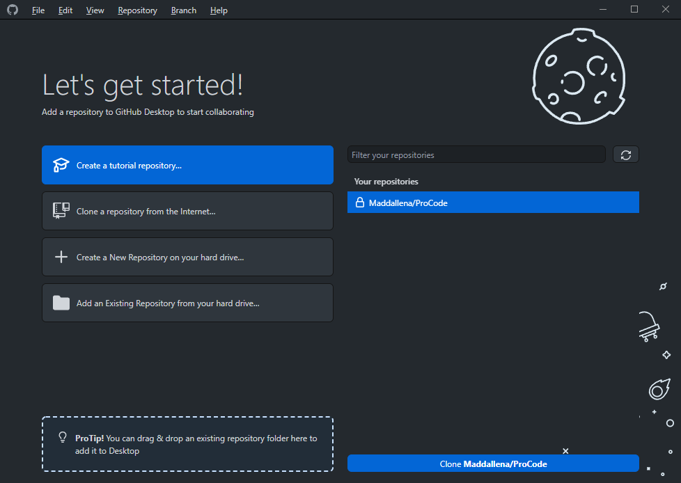
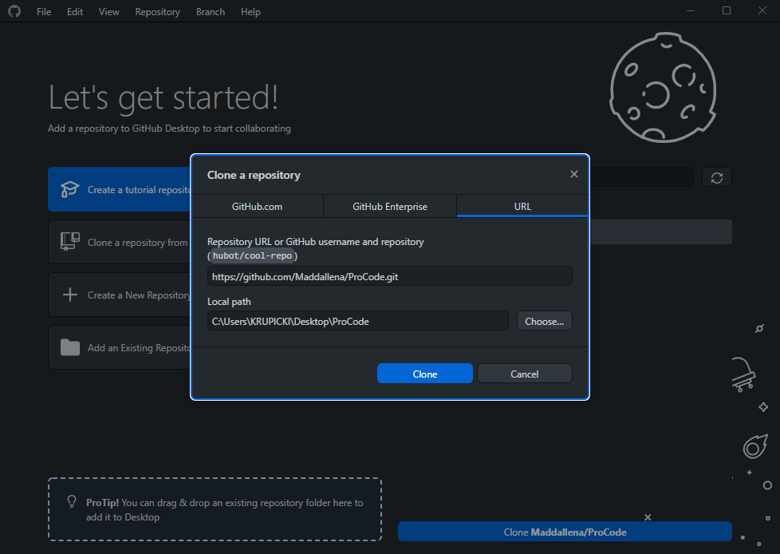
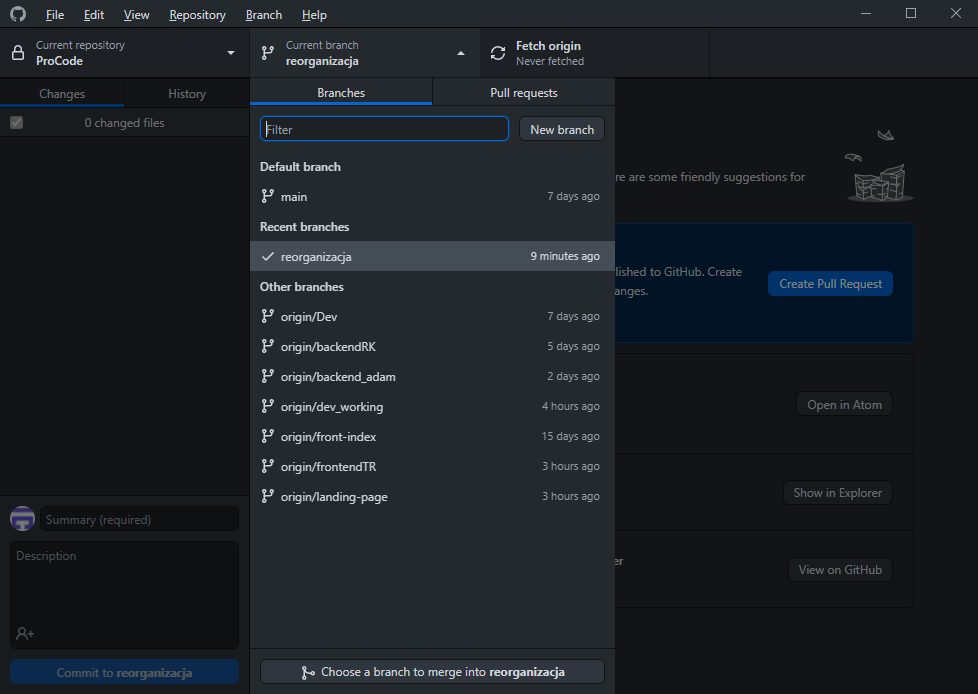
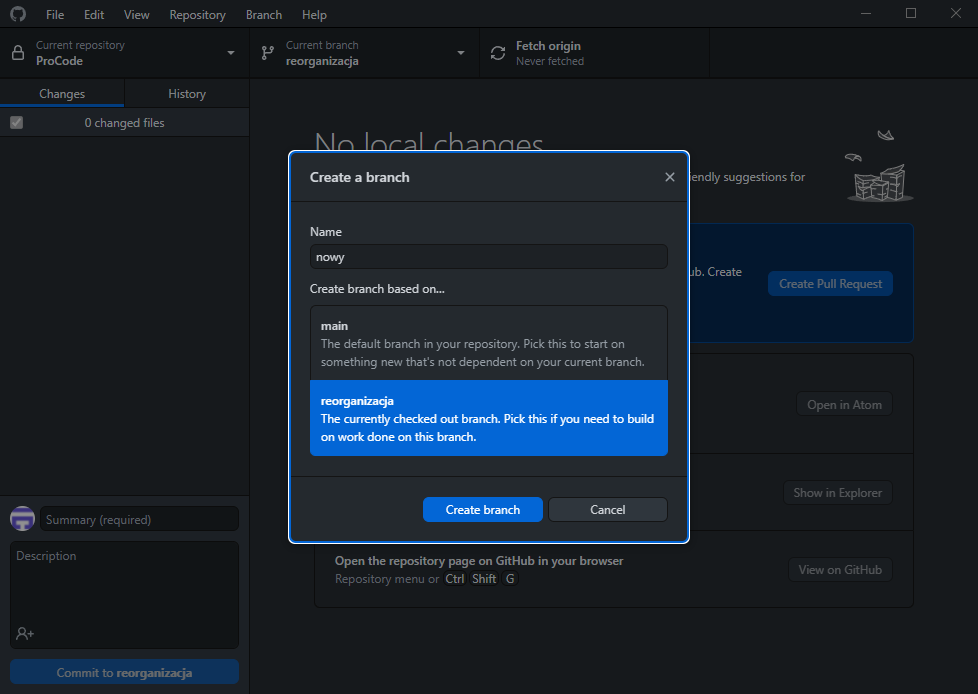
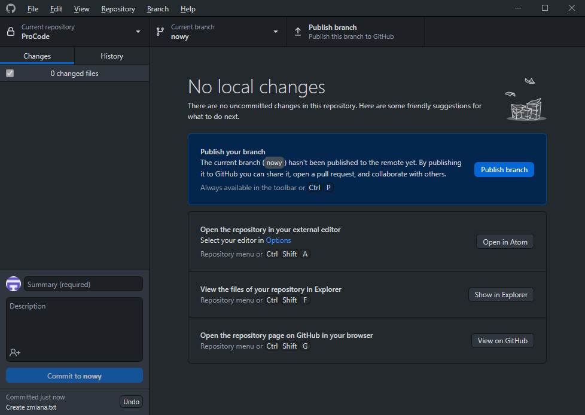

# Klonowanie repozytorium
1. Zaloguj się do aplikacji GitHub Desktop, wybierz repozytorium i kliknij Clone ...



2. Wybierz lokalizacje zapisu repozytorium



3. Wybierz branch reorganizacja



4. Stwórz nowy branch na podstawie brancha reorganizacja
   
   

5. Tworzysz zmiany w plikach

6. Zapisujesz zmiany, nadając tytuł, opis i klikasz Commit ...


7. Wysyłasz zmiany na GitHub klikając Publish branch



# Uruchamianie aplikacji

## Hierarchia projektu:

- ProCode - główny katalog projektu
  - pyvenv - wirtualne środowisko python
  - frontend - react
  - backend - django

## Tworzenie wirtualnego środowiska jeśli go jeszcze nie ma

W katalogu głównym projektu (ProCode) wykonujesz polecenia

    python -m venv pyvenv

    pyvenv\Scripts\activate.bat

    python -m pip install -r requirements.txt

Następnie w katalogu frontend wykonujesz polecenia:

    npm install

W tym momencie wszystko powinno być skonfigurowane

## Uruchamianie backendu
W katalogu backend należy użyc polecenia

    python manage.py runserver

## Uruchamianie frontendu:
W takalogu frontend należy użyc polecenia:

    npm start


# Konfiguracja - tylko przy tworzeniu repozytorium (NIE UŻYWAĆ)

## Backend

1. Tworzenie wirtualnego środowiska

   ```python -m venv pyvenv```

2. Aktywacja wirtualnego środowiska
   ```pyvenv\Scripts\activate.bat```

3. Instalacja django i dodatkowych pakietów
   ```python -m pip install Django```
   ```python -m pip install djangorestframework```
   ```python -m pip install django-cors-headers```
   ```python -m pip install mysqlclient```

4. Tworzenie projektu **backend** i przejście do katalogu
   ```django-admin startproject backend```
   ```cd backend```

5. Tworzenie aplikacji **api**
   ```python manage.py startapp api```

6. Uruchamianie **backendu**
   ```python manage.py runserver```
   
   ## Frontend

7. Tworzenie projektu **frontend** i przejście do katalogu
   ```npx create-react-app frontend```
   ```cd frontend```

8. Uruchamianie **frontendu**
   ```npm start```

9. Instalowanie dodatkowych pakietów
   ```npm install styled-components```
   ```npm install axios```
   ```npm install react-bootstrap bootstrap```
   ```npm install react-beautiful-dnd```

**Tworzenie listy wymagań dla _backendu_**
    ```pip freeze > requirements.txt```
**Instalowanie wymaganych pakietów dla _backendu_**
    ```python -m pip install -r requirements.txt```
**Instalowanie wymaganych pakietów dla _frontendu_**
    ```npm install```

**Wyszukiwanie zmian w modelach**
    ```python manage.py makemigrations```
**Zatwierdzanie zmian**
    ```python manage.py migration```
